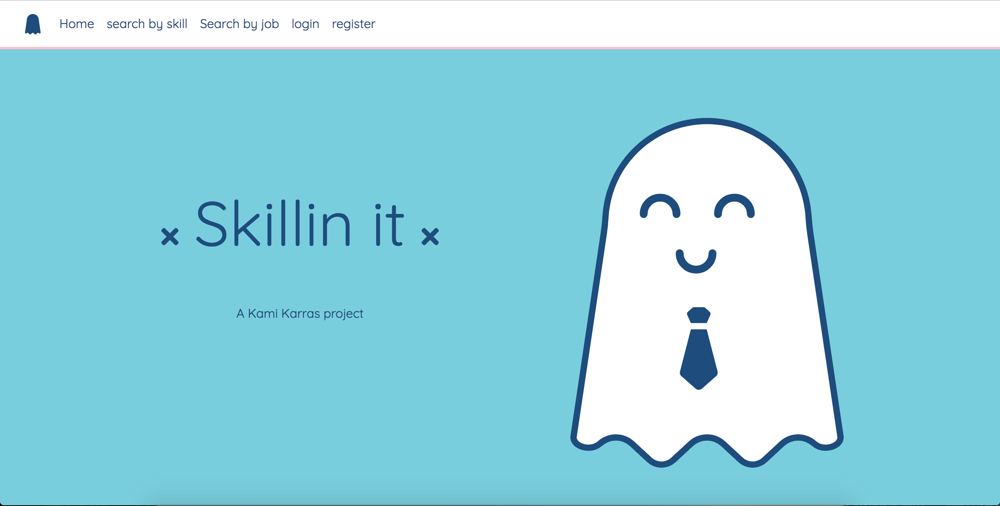

# Skillin-it

Skillin it is a career development website revolved around the skills needed for a career direction. The app finds the most requested skills in a giant dataset of job postings and gives users visual data about those skills. The app is intended for people entering a new career field and need direction. The users can use this tool to begin their new career change transition before they know which company they want to work for.

python - postgresql - sqlalchemy - flask - html - css - javascript - d3.js - jquery - bootstrap - jinja
